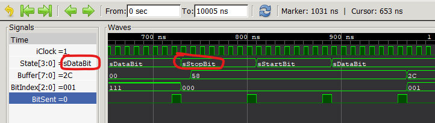

# SymbolEx
 
Command line tool for extracting symbols from Verilog source files. Symbols are extracted into files which can be used by GTKWave to replace number values with text identifiers in wave diagrams. This is useful for debugging FSM.




## How to use

### Mark Symbols in Verilog Source Files

Symbols for showing in GTKWave have to be grouped in verilog's `localparam` block with a special formatted comment. The comment marks that the block is intended for extracting symbols by SymbolEx. The comment has to be the single line comment (starting with `//`). The comment starts with the core name of the symbols file preceded by the `$` character which is not the part of the name. After the name follows bit size of the extracted values. The bit size has to be the same as a bit size of the register displayed in GTKWave.

Next example defines four symbol which will be extracted to file with name "States". Values will have size 4 bits.

```verilog
  localparam // $State:4
    sIdle     = 'b0001,
    sStartBit = 'b0010,
    sDataBit  = 'b0100,
    sStopBit  = 'b1000;
```

After the bit size can follows identifier prefix separated by comma. If the prefix is specified then SymbolEx removes that prefix from all identifiers in extracted block. It can be useful for increase clarity when displayed in GTKWave. For the previous example can be used `// $State:4,s` for removing prefix "s" from extracted symbols.


### Extract Symbols to Files

Use SymbolEx for extracting symbols to files. You can specify verilog source file or directory. If a directory is specified SymbolEx tryes to extract symbols from all files with extensions `.v` or `.sv` in the directory.

```
symbolex SerialTransmitter.v
```

Symbolex extracts symbols from each marked `localparam` block to separate file. Files are named by pattern `source_file.block_name.txt`. So for the previous example is created file with name `SerialTransmitter.State.txt`. You can specify output directory for extracted files as a second parameter. Option `--verbosity` can be used for listing processing details in several levels. For details run the SymbolEx without parameters.

Files with exported symbols have simple text format. For details read the manual of GTKWave. SymbolEx always converts numbers to hexadecimal format. For previous example SymbolEx will generate file with the following content:

```
1 sIdle
2 sStartBit
4 sDataBit
8 sStopBit
```


### GTKWave Setup

For switch signal values from numbers to text identifiers use function "Translate Filter Files". Move wire or register between displayed signals. __Then select the signal clicking on it.__ Then right click on the signal name. In a popup menu select "Data Format" then "Translate Filter File" and then "Enable and Select". In a window click on button "Add Filter to List" and choose the file with extracted symbols. __Then select the line with file path clicking on it.__ Then click on the button "OK".

The data format of signal selected in GTKWave has to be "Hex" becouse values of symbols exported by SymbolEx are always in hexadecimal format and GTKWave compares values as a text. The "Hex" data format is default after insert signal between displayed. So there is no need to change the data format.

Tested with GTKWave 3.3.100.


## License
Source code is provided under MIT license. 


